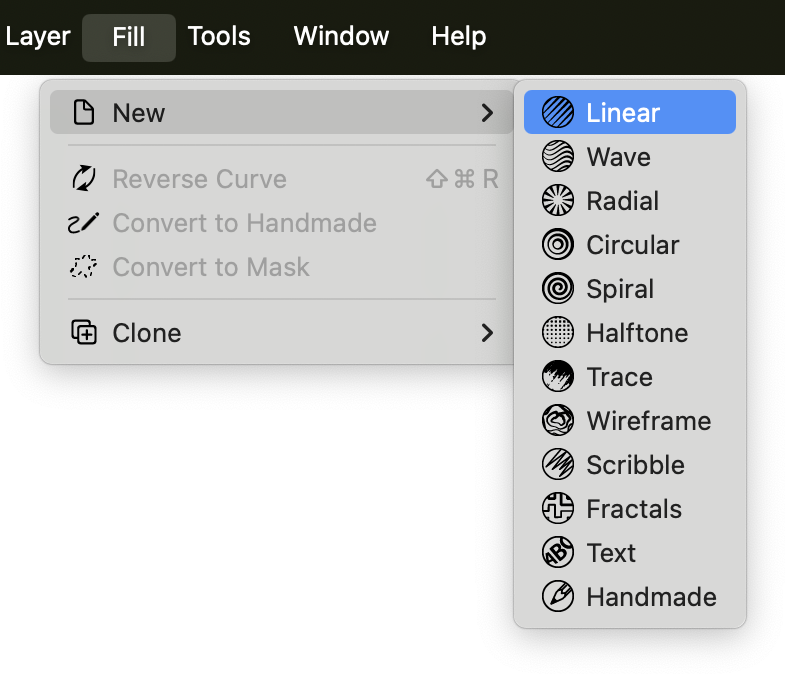
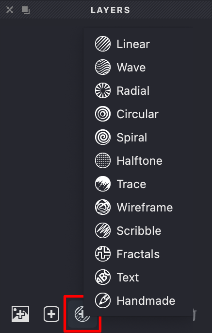
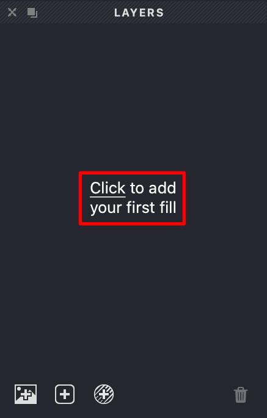
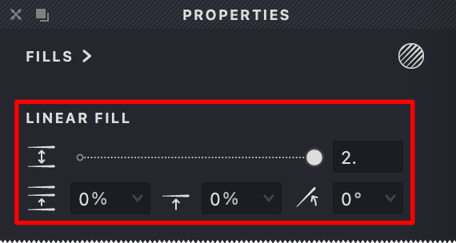

In Vexy Lines, a **Fill** is the core mechanism that transforms your source image into vector artwork. Fills generate patterns of vector lines or shapes based on the image’s details, with each fill type offering a distinct artistic style.

## How to Add a Fill

You can add a new **Fill** to your document in several ways:

#### Using the Main Menu

{width="393"}

1. Navigate to **Fill > New** in the main menu bar.
2. A dropdown list displays the available fill types.
3. Select the desired fill type.
4. The new fill is added to the currently selected layer (or a new layer if none is selected) and appears in the **Layers Panel**.

#### Using the Layers Panel

{width="218"}

1. Locate the **Layers Panel** (at the left side of the workspace by default).
2. Click the **Add new fill** button  at the bottom of the panel.
3. Choose the desired fill type from the pop-up menu.
4. The fill is added to the selected layer in your document.

#### In a New Document

{width="218"}

If your document is currently empty:

1. **Click to add your first fill** will appear in the **Layers Panel**.
2. Click this prompt to open the fill type selection menu.
3. Select a fill type to add it to a new layer.

## Overview of Fill Types

Vexy Lines offers a range of fill types, each producing a different visual effect:

### Basic Fills

 **Linear**: Generates straight, parallel lines. Suitable for clean, engraving-style effects.

 **Wave**: Creates parallel, wavy lines, adding a sense of flow or organic texture.

 **Radial**: Produces lines radiating from a central point, useful for emphasizing focus.

 **Circular**: Generates concentric circles, ideal for rounded forms or textures.

### Artistic Fills

 **Spiral**: Creates a continuous spiral pattern originating from a center point.

 **Halftone**: Simulates traditional halftone printing using dots or shapes of varying size.

 **Trace**: Automatically detects and outlines shapes based on the source image’s tonal values.

 **Wireframe**: Generates a network of lines connecting points based on the image, creating a structural look.

### Expressive Fills

 **Scribble**: Produces lines resembling hand-drawn scribbles for a sketchy effect.

 **Fractals**: Uses fractal algorithms (Hilbert or Gosper curves) to create intricate, space-filling patterns.

 **Text**: Uses text characters, mapped along paths, to represent image tones.

 **Handmade**: Allows you to draw or import custom vector paths to use as fill elements.

> **Recommendation for New Users:** The **Linear** and **Wave** fill types are excellent starting points for learning how fills interact with source images and properties.

## Customizing Fill Properties

Once a fill is added, you can adjust its appearance using the **Properties Panel**:

1. Select the fill you want to modify by clicking its name in the **Layers Panel**.
2. Locate the **Properties Panel** (usually positioned on the right side of the workspace).

   {width="285"}
4. The panel displays settings specific to the selected fill type.
5. Adjust fill parameters:
   
   **Interval:** Controls the spacing between lines or elements.

   **Angle:** Sets the orientation or direction of the fill pattern.

   **Thickness:** Adjusts the width of the lines or strokes.

   *(Other settings specific to the fill type will also be available.)*
7. Changes are reflected on the Canvas in real time, allowing you to see the effect of your adjustments immediately.

## Working with Fills

* **Start Focused:** Begin by experimenting with a single fill type to understand its behavior and settings.
* **Adjust Gradually:** Small modifications to properties like interval, thickness, or angle can significantly alter the result.
* **Layer Fills:** Combine multiple fills on different layers (or sometimes on the same layer) to create more complex and textured artwork.
* **Reset Option:** Look for reset buttons (to the right of many individual settings) in the Properties Panel to revert adjustments if needed.
* **Save Variations:** If you achieve a result you like, consider saving a version of your document (**File > Save As...**) before making further significant changes.

## Common Questions

**Q: Why doesn’t my fill appear correctly?**
A: This can happen if the source image is very complex or lacks contrast. Try using a simpler image initially. Also check the fill’s **Interval**, **Thickness**, and **Image Threshold** settings in the Properties Panel, as extreme values can sometimes produce unexpected results.

**Q: How can I increase the detail in my artwork?**
A: Reducing the **Interval** setting generally creates more lines and finer detail. For outlining shapes accurately, the **Trace** fill type can be effective. Experimenting with **Stroke Thickness** linked to image tone can also add detail.

**Q: Is it possible to use multiple fill types in one document?**
A: Yes. Combining different fill types, sometimes on separate layers, is a common technique for achieving rich and sophisticated vector illustrations in Vexy Lines.