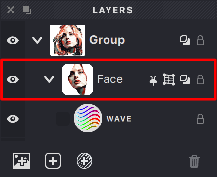
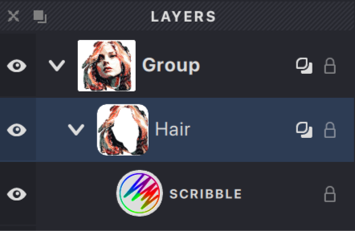
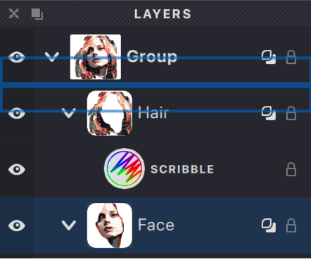

Layers are fundamental organizational tools in Vexy Lines, acting like transparent sheets stacked on top of each other. Each layer serves as a container for parts of your artwork, holding the Fills that create the visuals and optionally a Mask to control visibility. Using layers helps you manage complex designs, work on elements independently, and control the stacking order of your artwork.

{width="221"}

**A single layer usually contains:**

*   **Fills:** One or more Fill objects that generate the vector artwork.
*   **Mask:** An optional mask defining which parts of the layer's Fills are visible.
*   **Mesh:** An optional grid used for distorting the layer's Fills (not applicable to all Fill types, e.g., Trace, Handmade).

## When to Use New Layers

Creating new layers is beneficial when you need to:

*   Apply different Fill types or styles to distinct parts of your design (e.g., separate layers for skin, hair, and clothing in a portrait).
*   Isolate elements for easier editing without affecting other parts of the artwork.
*   Organize complex compositions logically.
*   Control the front-to-back arrangement of overlapping elements.

## Adding a New Layer

You can add a new layer to your document using these methods:

{width="221"}

*   Click the **Add New Layer** button  in the **Layers Panel**.
*   Choose **Layer > New > Layer** from the main menu.
*   If the document is empty, adding the first Fill will automatically create a new layer to contain it.

The new layer will appear in the **Layers Panel**. You can **double-click** its default name (e.g., "Layer 1") to **rename** it descriptively.

## Managing Layers

The **Layers Panel** provides controls for managing individual layers:

### Visibility

*   Click the **Eye icon**  next to a layer's name to toggle its visibility on the Canvas.
*   Hiding layers helps you focus on specific parts of your design.
*   Hidden layers are excluded from final exports.

### Selection

{width="221"}

*   Click on a layer's name or row in the **Layers Panel** to select it.
*   The selected layer is usually highlighted.
*   Many tools and properties only affect the currently selected layer.

### Arrangement (Stacking Order)

{width="221"}

*   Click and drag a layer up or down within the **Layers Panel** list to change its stacking position.
*   Layers higher in the list appear in front of layers lower in the list on the Canvas.
*   Use arrangement to control how elements overlap in your artwork.

Since each layer functions independently, you can freely experiment with Fills, Masks, and properties on one layer without altering the content of others.