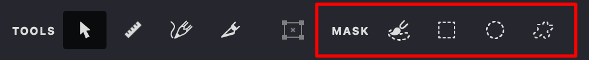

In Vexy Lines, a **Mask** controls the visibility of the Fills within a Layer. It acts like a stencil, defining precisely where the artwork on that layer appears or is hidden. Each Layer can have one mask associated with it.

{width="486"}

## How to Add a Mask

To **add** or **modify** a mask for a specific Layer:

1.  Select the target Layer in the **Layers Panel**.
2.  Choose one of the mask creation tools from the **Toolbar**:
     **Brush** {*B*}): Paint mask.
     **Rectangle** {*I*}: Draw rectangular mask.
     **Ellipse** {*O*}: Draw square or elliptical mask.
     **Freeform** {*S*}: Draw custom mask.
3.  Use the selected tool on the Canvas to define the mask area.

## Mask Creation Methods

Masks can be created using two primary approaches:

*   **Manual Drawing:** Use the Brush, Rectangle, Ellipse, or Freeform tools to draw shapes directly, defining the visible areas.
*   **Auto-Detection (Shape Tools):** The Rectangle, Ellipse, and Freeform tools include an intelligent auto-detection feature. Clicking on distinct shapes or tonal areas in your source image will automatically generate a corresponding mask shape.

**Using Auto-Detection Modifiers:**

When using the auto-detection feature of the Rectangle, Ellipse, or Freeform tools:

*   **Click**: Detects a shape and *adds* it to the existing mask area.
*  {*⌥*}+**Click**: Detects a shape and *subtracts* it from the existing mask area.

The following sections provide detailed instructions on using each specific mask creation tool effectively.