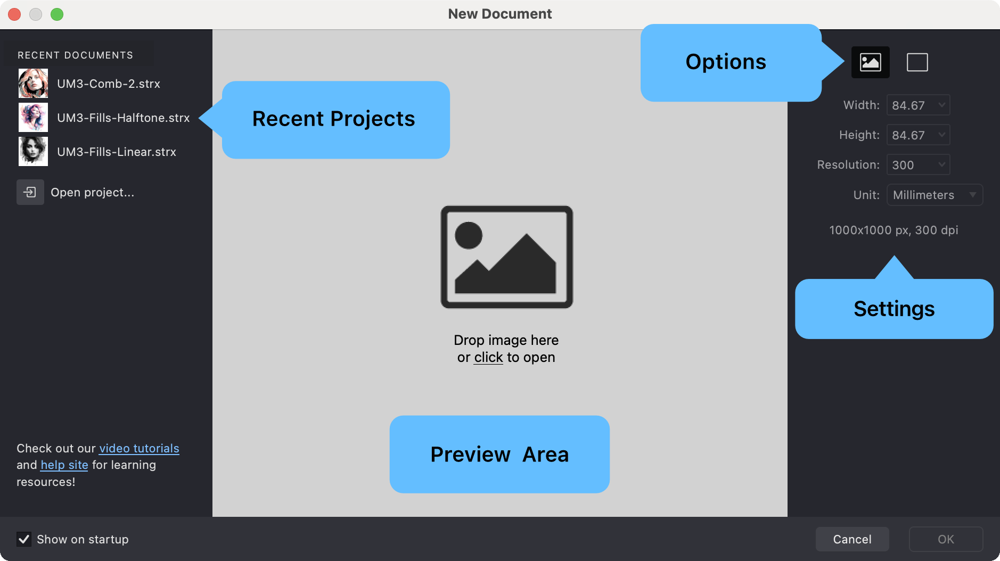
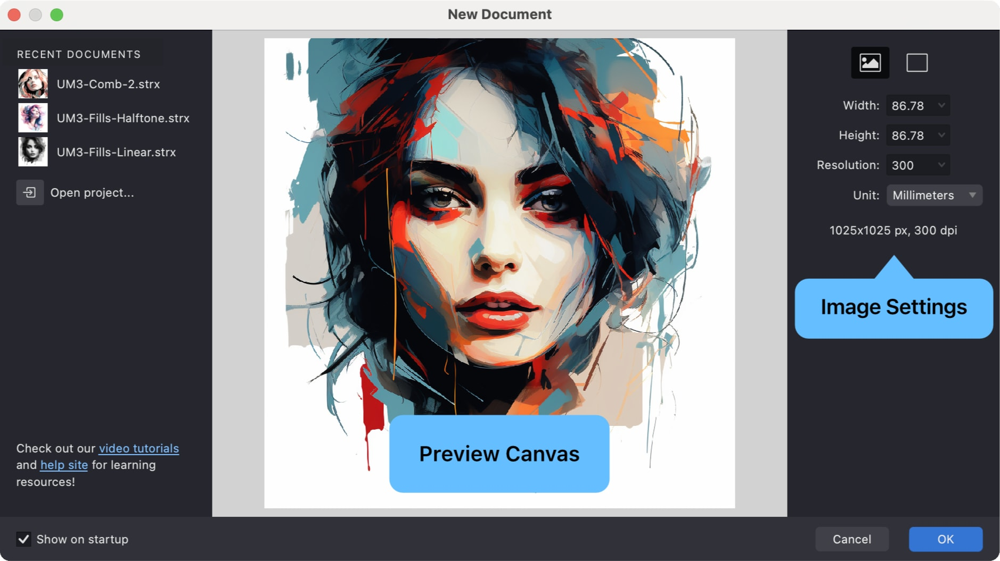
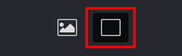
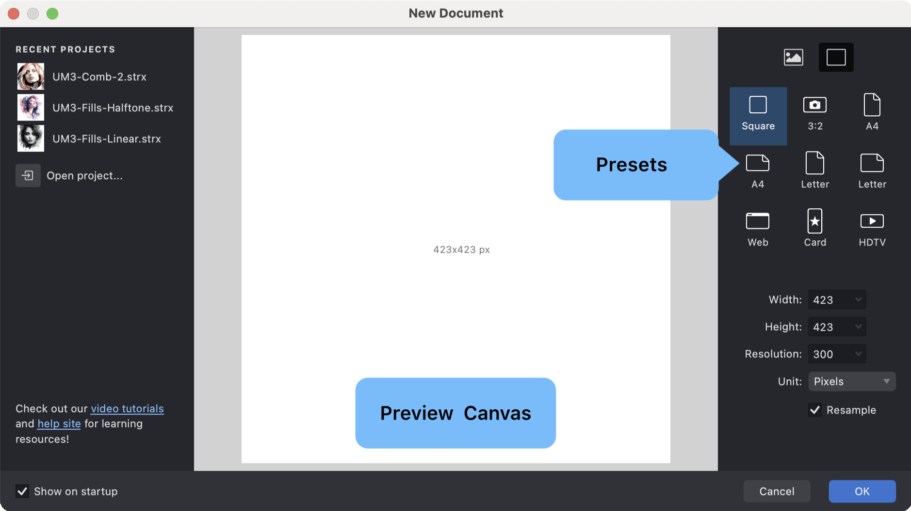

Creating a new document in Vexy Lines is the first step in turning your vector ideas into finished artwork. Here’s how to do it, step by step.

## The New Document Dialog

1. Click **File > New** from the top menu ({*⌘N*} on macOS / {*⌃N*} on Windows).

{width="800"}

2. The **New Document** dialog will appear, showing:

   * A **Preview Area** with the initial state of your document.
   * Access to **Recent Documents** for quickly reopening previous work.
   * **Settings** to configure the new document’s properties.
   * Two primary options, selectable in the top-right corner:

     **Image icon**: Start with a source image as a reference (recommended).
     **Empty canvas icon**: Start with a blank document.

## Set Up Your Document

When creating a new document, you’ll configure a few settings to get started. Here are the key options:

### Using a Reference Image

Many Vexy Lines documents begin with a **source image** (such as a photo or illustration) that serves as a guide for vector creation.

{width="939"}

1. **To add a source image**:

   * Click the **Image icon** to browse and select an image file from your computer, or
   * **Drag an image file** from your computer directly onto the preview area or the Vexy Lines application icon, or
   * If you **copied your image** from another image-editing app, click the **Paste from Clipboard** button at the bottom of the preview area to insert the image.
2. The selected image appears in the preview window.
3. The document dimensions update automatically to match the image size.

You can find some royalty-free sample images at: [gallery.vexy.art](https://gallery.vexy.art)

> Photos with clear outlines or silhouettes work best when you’re starting out. Think portraits, simple objects, or landscapes with distinctive shapes.

### Starting with a Blank Canvas

If you prefer to create vector artwork without a reference image:

{width="184"}

1. Click the **Empty canvas icon** in the top-right corner of the dialog.
2. Select a **Preset Size** or define **custom dimensions** in the settings area.
3. The preview displays a blank canvas based on your chosen size.

### Choosing the Right Size

Vexy Lines provides standard presets to simplify setup for common uses:

{width="939"}

#### Built-in Presets
* **Square**: Square format, suitable for profile pictures or icons.
* **3:2**: Standard photographic aspect ratio.
* **A4**: International standard paper size for print.
* **Letter**: US standard paper size for print.
* **Web**: Optimized dimensions for screen and web graphics.
* **Social**: Common dimensions for vertically oriented screen.
* **HD**: Standard 16:9 high-definition video format.

#### Custom Sizes
You can also define specific dimensions:

* Enter values directly into the **Width** and **Height** fields.
* Select the desired measurement **Units**: Pixels (px), Millimeters (mm), or Inches (in).
* The preview updates to reflect your custom size.

### Understanding Resolution (dpi)

Resolution, measured in dots per inch (**dpi**), affects the detail level of the *source image* displayed on your canvas. Your final *vector artwork* remains perfectly scalable regardless of this setting.

* **300 dpi:** Recommended for high-quality print output.
* **150 dpi:** Suitable for large-format prints viewed from a distance.
* **96 dpi:** Standard resolution for web and screen display.

> **Note:** Higher dpi values provide a more detailed view of your source image but may use more system resources.

## Additional Features

The **New Document** dialog includes several conveniences to streamline your workflow:

* Quickly **reopen** documents from the **Recent Document** list.
* Your **last used settings** are usually remembered for faster setup.
* **Links** may be provided for accessing help resources or tutorials.

Once your document is configured, click {[OK]} to open the workspace and begin creating.