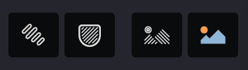
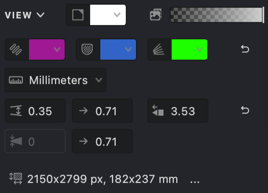

Vexy Lines provides several options to customize how your document and artwork are displayed during the creation process. Adjusting these settings can help you focus on specific elements, improve editing accuracy, and tailor the workspace to your preference.

## Toolbar View Controls

The main **Toolbar** includes quick-access buttons to toggle the visibility of key elements:

{width="177"}

-01.svg) **Highlight Selection** 
When enabled, highlights the edges of current selection.

-01.svg) **Highlight Masks**
Highlight the edges of masks and the grid lines of meshes.

 **Show Fills**
Toggles the visibility of all generated Fill artwork on the Canvas. Turn this off to focus solely on Masks or Source Images.

 **Show Source**
Toggles the visibility of any Source Images associated with the document or active Group.

## View Menu

The **View** option in the main menu bar provides access to a broader range of display settings, including:

*   Zoom level controls and navigation commands.
*   Options to show or hide specific user interface panels (like Properties, Layers, etc.).
*   Settings for the workspace background color.
*   Manual refresh commands and rendering quality options (if applicable).

## Workspace Settings

The **Properties Panel** contains a dedicated **VIEW** section offering more granular control over display elements:

{width="300"}

   **Document color** sets the background color of the document.

 **Background image opacity** adjusts the transparency of the source image so it does not dominate the working result.

 **Selection highlight** displays selected elements with an outline.

 **Bounds and controls** shows control elements, handles, and masks.

 **Editable curves** highlights underlying curves available for manual editing.

 **Units** defines the measurement units used in the document.

 **Fill interval range** sets the minimum and maximum interval values for fills.

 **Max cap length** controls the maximum sharpening of curve endpoints.

 **Line thickness range** defines the minimum and maximum thickness of fill lines.

