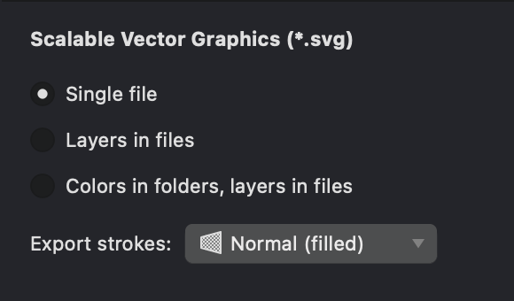
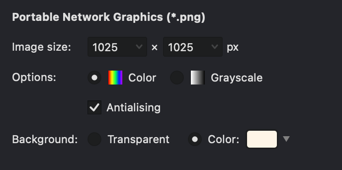

When your project is complete, you can export it into various file formats suitable for use in other applications, printing, web display, or further editing. Vexy Lines offers options for exporting both scalable vector graphics and fixed-size raster images.

.png){width="400"}

## Vector Export

Vector formats preserve the mathematical descriptions of your artwork, allowing it to be scaled infinitely without losing quality. They are ideal for logos, illustrations intended for print, and designs that may need resizing. 

Common vector export formats include:

*   **SVG (Scalable Vector Graphics):** A widely supported standard for web graphics and interoperability between vector editing applications.
*   **PDF (Portable Document Format):** Excellent for sharing documents and high-quality printing, preserving vector data and layout.
*   **EPS (Encapsulated PostScript):** A legacy format often used in professional print workflows.

### Vector Export Options

When exporting to vector formats (SVG, PDF, EPS), Vexy Lines provides options to control how the document structure is saved in the output file. Select the option that best fits how you plan to use the exported artwork:

{width="380"}

* **Single File:** This is the default setting. Vexy Lines combines all visible layers into a single layer or group in the exported file. The visual appearance is preserved, but the original Vexy Lines layer structure is discarded. Choose this for final delivery or when layer separation is not needed in the destination application.
* **Layers in files:** This option preserves the layer structure from your Vexy Lines document within the exported file, representing layers as native layers or groups where the format supports it (e.g., SVG). Select this when you need to maintain layer organization for continued editing in other vector software (such as Adobe Illustrator, Affinity, or Inkscape).
* **Colors in folders, layers in files:** This option organizes the exported artwork based on shared colors, grouping all elements of the same color together while still preserving layers. It is designed for workflows that require color separation, such as screen printing or vinyl cutting.

> The availability and exact behavior of these export options depend on the capabilities of the chosen vector format (SVG, PDF, or EPS). Review the export settings to ensure the output matches your requirements.

## Raster Export

Raster (or bitmap) formats represent artwork as a grid of pixels. They are suitable for web images, photographs, and situations where scalability is not the primary concern. Common raster export formats include:

*   **PNG (Portable Network Graphics):** Loseless format which supports transparency, making it ideal for web graphics or overlays.
*   **JPEG (Joint Photographic Experts Group):** Offers good compression for smaller file sizes, suitable for photographs on the web (does not support transparency).

### Raster Export Options 
When exporting to raster formats, you can control:

{width="380"}

*   **Dimensions:** Set the exact width and height in pixels.
*   **Color Mode:** Choose between color or grayscale output.
*   **Transparency:** Configure transparency options for formats like PNG.
*   **Background Color:** Select a background color if transparency is not used or supported.

## The Export Process

To export your artwork:

1. Choose **File > Export As...** from the main menu.
2. In the export dialog, choose the format (e.g., SVG, PNG, PDF, or JPG).
3. Choose where your exported data should go. You can **copy** it to the clipboard and paste it into a vector or raster editor to continue working with the image, or save it to a file. If **Export next to document is selected**, Vexy Lines will not ask for a file name but will save to the same folder your document was opened from.
4. Configure any available **Export Settings** specific to the chosen format (e.g., dimensions, layer handling, quality).
5. Click **OK** to generate the file.
 
If you are happy with the export settings, you can use File > Export and your image will be exported using the last selected settings without asking for any additional details.

> Exporting functionality requires an activated, licensed version of Vexy Lines. Trial or demo versions may allow you to preview export options but might restrict saving the final output files.

## Clipboard Operations

For quick transfers to other vector editing applications (like Adobe Illustrator or Affinity), Vexy Lines supports copying artwork directly to the system clipboard.

* Select the desired elements or layers in Vexy Lines.
* Use the **Edit > Copy** command ({*⌘C*}/{*⌃C*}).
* Switch to the other application and use its **Paste** command ({*⌘V*}/{*⌃V*}).

This method usually preserves the vector nature of the artwork, allowing further editing in the destination application. Compatibility may vary depending on the applications involved.

To customize the formats placed on the clipboard, use the **File > Export As…** command and choose **Copy to clipboard**. Adjust the export settings and click **OK** to proceed. Next time, you can simply use **File > Export** ({*⌘E*}/{*⌃E*}) to place your image on the clipboard using the last export settings.