When you work with Fills in Vexy Lines, the **Properties Panel** gives you detailed control over their appearance and behavior. Fills are the core elements that generate vector artwork from your source image, and their properties let you fine-tune the result to match your desired style.

## Fill Properties Overview

Each Fill type has a unique set of parameters, but many properties are shared across different types. These settings control aspects such as color, line appearance, interaction with the source image, and special effects.

### Using Linear Fill as an Example

This guide uses the **Linear Fill** type to illustrate common properties. [Linear Fill](vb://article/linear-fill) generates parallel straight lines, mimicking traditional engraving or hatching. Its versatility makes it well suited for demonstrating fundamental concepts applicable to most fill types.

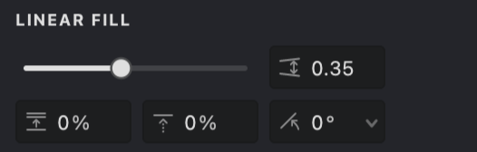{width="300"}
####  Interval
Sets the spacing between parallel lines. Smaller values create denser patterns; larger values create more open spacing.

####  Shift
Offsets the entire pattern perpendicular to the line direction, useful for positioning or layering fills.

####  Angle
Determines the orientation of the lines.

## Color Settings

Fills can derive their color in two primary ways: statically (a single chosen color) or dynamically (based on the underlying source image).

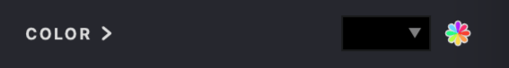{width="300"}

### Static Color
When **Static Color** is selected, the entire fill uses a single, uniform color. You can define this color using various tools within the color selection interface:

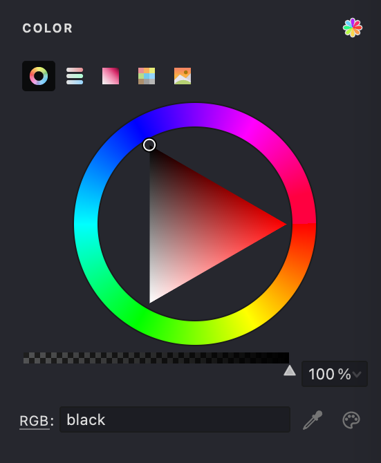{width="300"}

#### Color Wheel
Visually select hue, saturation, and brightness.

#### Sliders Panel
Precisely define colors using RGB, HSB, or Grayscale values.

#### Box Panel
Select from a grid of common colors.

#### Swatches
Choose from predefined color palettes (e.g., Standard, Light, Dark, Photoshop). The color palette generated from the **Source image** is available alongside the other palettes.

#### Picture Panel
Load an image to sample colors from it.

#### Pick Screen Color
Sample a color from anywhere on your display.

#### System Color Dialog
Access your operating system's native color picker.

> You can also adjust the **Opacity** of the static color to create semi-transparent fills, which works differently compared to the actual fill opacity setting.

### Dynamic Color

When **Dynamic Color** is enabled, the fill samples color information directly from the source image underneath it. This creates a more integrated and varied appearance, adapting to the image's tones.

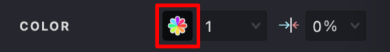{width="300"}

For fills composed of lines or curves (like Linear or Wave), you can control:

#### Color segment length
Determines how frequently the color is sampled along the line. Shorter segments capture more color variation; longer segments result in smoother transitions.

#### Color segment length variation
Introduces randomness to segment lengths, preventing overly uniform or mechanical patterns.

> Dynamic color is often effective for photographic source images or those with rich color gradients. Static color may provide better control for graphic designs or illustrations that require specific color palettes.

## Filters

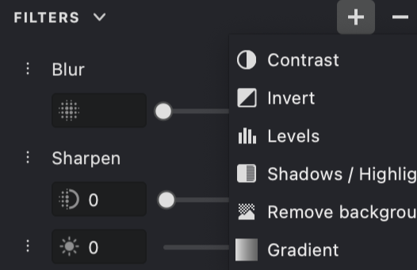{width="300"}
The **Filters** Panel provides a set of tools for modifying the appearance of the image before and during processing. Each filter applies a specific visual adjustment, allowing you to refine the result step by step.

Filters can enhance details, adjust tones, control color, or introduce stylized effects. They are typically applied in sequence, so the order of filters can influence the final outcome.

This panel is useful for both subtle corrections and more creative transformations, helping you achieve the desired visual style with precision.

#### Image & Signal
The **Image & Signal** setting determines which tonal range of the source image influences the fill's generation and appearance (for example, where lines appear or how thick they are). The threshold is defined on a scale from 0 (pure black) to 255 (pure white).

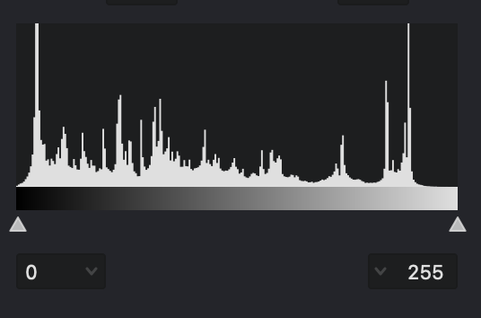{width="300"}

* The histogram visualizes the tonal distribution of your source image.
* Adjust the minimum (left slider) and maximum (right slider) threshold values to isolate specific brightness ranges.
* For example, setting a lower maximum value focuses the fill on darker areas, while adjusting both sliders can isolate midtones.
* An **Inverted mode** is available, useful when working with light-colored fills on dark backgrounds.

## Stroke Properties

These properties control the visual characteristics of the strokes generated by the fill.

### Stroke Thickness

Adjust the thickness of the fill lines or the size of elements in fills like Halftone.

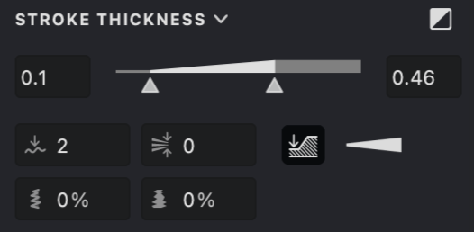{width="300"}

Key controls include:

#### Thickness
Set minimum and maximum thickness values using a combined slider.

#### Transition Mode
Define how thickness varies based on image tone (for example, linear variation, emphasizing thicker lines, or emphasizing thinner lines).

#### Smoothing
Smooths out sharp changes in thickness along a line.

#### Thickness at Line Breaks
Determines whether thickness resets to the minimum at line breaks or continues from the previous value.

#### Gap Control
Auto-thin strokes in crowded areas to reduce visual clutter and keep the distance between strokes visually balanced

#### Inverted Mode
Reverses the thickness mapping, making lines thicker in lighter areas (useful for light-colored strokes).

> Double-click **Thickness Range** to adjust the available range.

### Dashed Lines

Create dashed or dotted line patterns instead of solid lines.

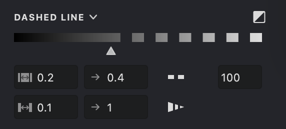{width="300"}
Parameters include:

#### Threshold
Controls which tonal range of the image triggers the dashed effect.

#### Dash Length
Set minimum and maximum lengths for the dashes.

#### Gap Length
Set minimum and maximum lengths for the spaces between dashes.

#### Inverted Mode
Reverses the threshold mapping, suitable for light-colored strokes.

> Dashed lines can be used effectively for textures, suggesting movement, or creating stylized, hand-drawn looks.

### Line Caps and Joins

Define the appearance of line endings (caps) and corners where line segments meet (joins).

{width="300"}

Options allow customization of:

#### Start/End Caps
Choose Flat, Round, or Triangle shapes for the beginning and end of lines. The Triangle cap includes a length parameter for adjusting sharpness.

#### Intermediate Caps (for Dashes)
Flat or Round.

#### Join Style
Choose Bevel (flattened corner) or Round for how segments connect.

> Triangle caps with adjustable length can be particularly useful for rendering elements like hair or grass.

## Special Effects

These optional effects add depth and refinement to your fills.

### Emboss Effect

Simulates a raised (embossed) or recessed (debossed) appearance on the fill lines, adding a sense of dimension.

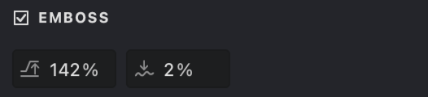{width="300"}
#### Height
Controls the intensity of the effect (positive for raised, negative for recessed).

#### Smoothness
Adjusts the softness of the transition for the effect.

> Embossing can enhance textures, portraits, and graphic elements by adding subtle or pronounced depth.

### Smooth Mask

*This property relates to the Layer's mask, not the Fill itself, but is often relevant when considering the Fill's final appearance.*

When enabled in the Layer's mask properties, **Smooth Mask** softens the mask edges, allowing for feathered transitions and blending between layers. Adjust Opacity and Feather radius for the desired result.

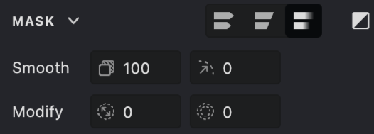{width="300"}
## Transform and Positioning

*These properties apply to the Layer or Group containing the Fill, affecting its overall placement and scale.*

Standard transformation tools allow you to move, resize, rotate, and skew the selected object (Layer or Group). A dedicated **Transform** panel provides precise numerical control over these operations, using reference points for accuracy.

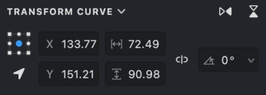{width="300"}
## Combining Properties

The true potential of Vexy Lines emerges when you combine various fill properties creatively. Experimenting with different combinations is key to developing unique styles.

Consider combinations such as:

* Dynamic Color + Variable Stroke Thickness + Emboss for nuanced portraits.
* Dashed Lines + Triangle Caps + specific Image Threshold settings for stylized illustrations.
* Static Color + Smooth Mask (on the Layer) for subtle background textures.

By mastering these properties, you gain fine-grained control over your vector artwork. Refer to specific articles for detailed explanations of properties unique to each Fill type.