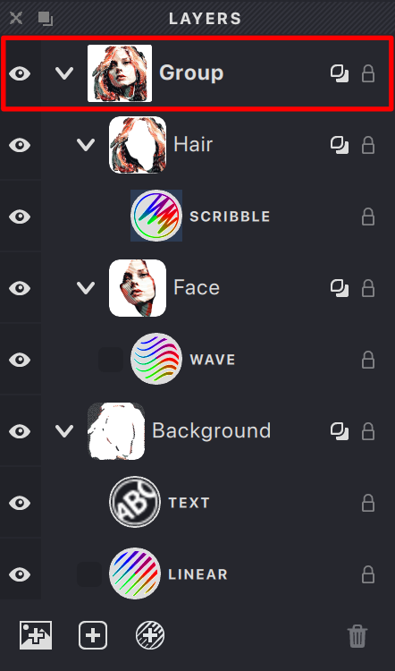
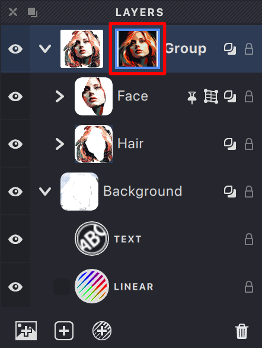
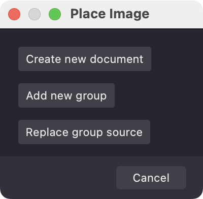

As your documents become more complex, **Groups** provide a powerful way to organize your document structure in Vexy Lines. Similar to folders on your computer, Groups act as containers that can hold multiple Layers, other Groups (creating nested structures or sub-groups), and even their own dedicated **Source Image**.

Using Groups helps keep your **Layers Panel** tidy and allows you to manage related parts of your artwork collectively.

{width="221"}

## Creating Groups

There are several ways to create a Group:

*   Click the **New Group** button (icon: ) in the **Layers Panel**.
*   Choose **Layer > New > Group** from the main menu.
*   Select one or more Layers or existing Groups in the Layers Panel and use the shortcut {*⌘G*} (macOS) / {*⌃G*} (Windows).

## Using Source Images with Groups

A key feature of Groups is that each can have its own **Source Image**. This image serves as the reference for calculating Fill properties (like dynamic color or thickness variations) for all Layers contained within that Group and its sub-groups.

*   **Purpose:** Source Images guide the appearance of Fills but are not part of the final exported artwork.
*   **File Types:** You can use standard raster images (PNG, JPEG, TIFF) or vector files (SVG, PDF) as Source Images.
*   **Inheritance:** If a Group does not have its own Source Image assigned, its Layers will inherit and use the Source Image from the nearest parent Group above it in the hierarchy. If no parent Group has a Source Image, the document's main Source Image (if one exists) is used.

{width="221"}

## Adding and Managing Source Images in Groups

You can assign or change a Group's Source Image using these methods:

*   **Via Menu:**
    1.  Select the target Group in the **Layers Panel**.
    2.  Choose **Layer > Add Source** (to add) or **Layer > Replace Source** (to replace).
    3.  Select your desired image file.
    4.  An interface may appear allowing you to position and scale the image relative to the document canvas. Adjust as needed and press {*⏎*} to confirm.
*   **Via Drag and Drop:**
    1.  Drag an image file from your computer directly onto the Vexy Lines application window.
    2.  A dialog will appear. Choose an option like **Add as Source to New Group** or **Add/Replace Source in Selected Group**.
        {width="200"}
    3.  Position and scale the image if prompted, then press {*⏎*}.

**Managing Existing Source Images:**

*   **Select:** Click the small image icon next to the Group name in the Layers Panel to select the Source Image itself.
*   **Transform:** Once selected, you can usually resize or reposition the Source Image on the canvas using standard transform controls.
*   **Remove:** With the Source Image selected (by clicking its icon in the Layers Panel), press the {*Del*} or {*Backspace*} key, or use the {[Delete]} button in the Layers Panel.

## Organizational Benefits of Groups

Beyond managing Source Images, Groups enhance document organization:

*   **Hierarchy:** Nest Groups within other Groups to create logical structures for complex designs (e.g., a "Character" group containing "Head" and "Body" sub-groups).
*   **Visibility Control:** Toggle the visibility of an entire Group (and all its contents) using the Eye icon in the Layers Panel.
*   **Bulk Operations:** Select a Group to apply transformations (move, scale, rotate) or other actions to all contained Layers simultaneously.
*   **Easy Reordering:** Drag and drop Layers or sub-groups into or out of different parent Groups in the Layers Panel.

Effectively using Groups and their associated Source Images is crucial for maintaining clarity and efficiency in complex Vexy Lines documents.